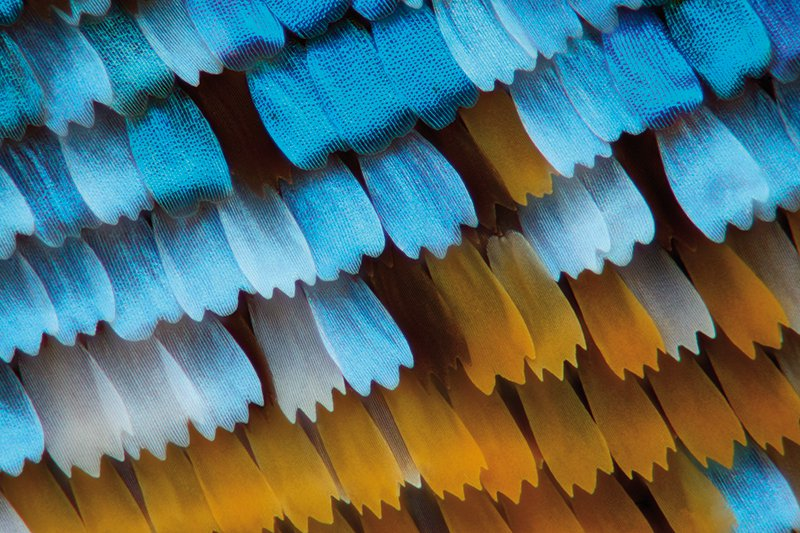
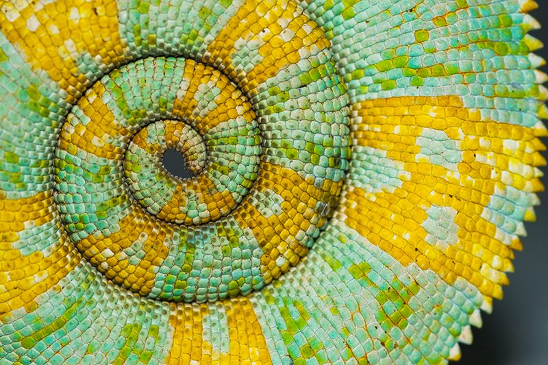

# 程序化自然：一组基于自然元素的生成式算法

### Procedural Nature: Generative Algorithms Based on Natural Elements

2022/6/11 Zhu Ziyi

## 项目背景

本项目是基于探索物理计算和传感器设备在促进公民科学与自然探索活动当中所能提供的新的可能性所进行。

近年来相关技术已经为公民科学以及开展自然探索活动提供了众多新的形式。当前人们可以很轻松地基于这些技术制作与使用自己的设备和仪器，为他们自己的实验或作为更大项目的一部分收集数据。然而审视公民科学的现状，一个主要问题是如何将公民参与不仅视为一种监测活动，而是将这些技术与设备视为促进公民参与的组成部分，同时对生态意识产生积极影响，并改变人们对城市自然和自然价值的看法。

### 深层生态学

[深层生态学（Deep Ecology）](https://en.wikipedia.org/wiki/Deep_ecology)是一种环境哲学理念，其倡导一种反“人类中心主义”的价值取向，强调一切生物具有其本质的价值，而与人类使用的工具性利益无关，并以此为基础推动社会机制的改变。

该学说主张以现代资本主义为代表的基于“人类中心”的现代社会价值体系导致了现有的环境问题，并期望通过意识形态的转变来建立一种以“自然和环境中心”的价值体系。

> "The ideological change is mainly that of appreciating life quality…rather than adhering to an increasingly higher standard of living.…" *-A.Naess*

> “意识形态的转变主要是强调生活的质量而非更高的生活标准。” *-A.奈斯*

*The Blue Marble, taken by the Apollo 17 crew in 1972*

其提倡通过加深个人与自然的联系，达成与自然的和谐，从而建立起“生态上的自我认同”以及一种“环境道德观念”。
 
本项目在这一语境下，以公民科学的形式为基础，期望通过某种方式使人们建立起对环境，对自然更加深层次的理解。从而对人们的生态意识，以及针对城市自然整体的生态活动提供帮助。

## 整体理念

已经习惯于现代工业化社会的我们，多数时间都处于“人造的”、以“工业化生产逻辑”被创造的环境当中。尽管在这一环境当中，自然仍然广泛地存在着，但是由于社会环境与生活方式的影响，自然常常作为背景为人们所忽略，许多自然的细节与现象也被我们所忽视，与自然的关系也因此难以建立。
            
### 如何感受自然

At a smaller scale, the scales that make up those butterfly wing patterns are etched with parallel ridges that scramble light waves hitting them so that only certain colors are reflected.
*-Nikola Rahme/Shutterstock.com*

A furled chameleon tail obviously takes its shape from the rolling of a tube, but its pattern is distinct from that created by rolling an even tube, such as that of a garden hose. The gentle taper of the tail produces a logarithmic spiral—one that gets smaller, yet the small parts look like the large parts.
*Michal Filip Gmerek/Shutterstock.com*
 
> 兰花，蜂鸟和孔雀尾巴等生物具有抽象的设计，具有艺术家难以匹配的形式，图案和颜色之美。人们在自然界中感知到的美在不同层面上都有原因，特别是在控制哪些模式可以物理形成的数学中，以及在自然选择的影响下，在生物中，控制着模式如何演变。

> 数学试图发现和解释各种抽象的模式或规律性。自然界中的视觉模式在混沌理论、分形、对数螺旋、拓扑学和其他数学模式中都有解释。例如，L系统形成了令人信服的不同树木生长模式模型。

> 物理定律将数学的抽象应用于现实世界，通常就好像它是完美的一样。例如，当晶体没有位错等结构缺陷并且完全对称时，它是完美的。精确的数学完美只能接近真实的物体。自然界中的可见模式受物理定律的支配。例如，蜿蜒曲折可以用流体动力学来解释。

> 在生物学中，自然选择可以导致生物模式的发展，原因有几个，包括伪装，性选择和不同类型的信号传导，包括模仿和清洁共生。在植物中，像百合花这样以昆虫授粉的花朵的形状、颜色和图案已经进化到吸引蜜蜂等昆虫。颜色和条纹的径向图案，有些仅在紫外线下可见，作为花蜜指南，可以在远处看到。

自然在基础层面受基本的物理与数学定律所控制，研究已经发现大多数自然界的物体在不同的尺度下常表现出不同的基本数理结构，但我们常常不是对这些知识不太熟悉就是没有消息观察。同时，也很难将这些抽象的概念与现实生活中的实体相联系。

然而这些结构其实十分重要，它们反映了自然界构建与运行的原理以及其在系统当中的交互方式。此项目通过使用一系列与自然相关联的算法生成与自然界物体相呼应的输出，来展现自然界其内含的结构与内在规律，作为用于开展公民科学与城市自然探索的材料与工具。

## 分形与自相似

[分形（Fractal）](https://en.wikipedia.org/wiki/Fractal) 是无限[自相似（self-similar）](https://en.wikipedia.org/wiki/Self-similarity)的，具有分形维数的迭代数学结构。分形状图案在自然界中广泛存在，存在于云层、河流网络、地质断层线、山脉、海岸线、动物着色、雪花、晶体、血管分支、肌动蛋白细胞骨架以及波浪等多种现象中。

*The geometric beauty of leaves. by Paul Boukle*

*Fractal forms found by using Google Earth. by Paul Boukle*

> 无限迭代在本质上是不可能的，所以所有的“分形”模式都只是近似的。例如，蕨类植物和伞形植的叶子只有自相似（羽状）到2，3或4个水平。蕨类植物和动物的生长模式发生在植物和动物中，包括苔藓动物，珊瑚，空气蕨类植物，阿根廷蜥蜴等水生动物，以及非生物，特别是放电。L系统分形可以通过改变少量参数来模拟不同的树木生长模式，包括分支角度，节点或分支点之间的距离（节点间长度）以及每个分支点的分支数量。

本项目使用了包括L系统，迭代函数系统，和混沌博弈在内的算法来生成不同的具有自相似性的分形图像。

### 迭代函数系统

在数学中，[迭代函数系统（Iterative Function System, IFSs）](https://en.wikipedia.org/wiki/Iterated_function_system)是一种构造分形的方法；由此产生的分形通常是自相似的。IFS 分可以具有任意数量的维度，但通常以 2D 形式计算和绘制。分形由自身的几个副本的并集组成，每个副本由一个函数转换（因此称为“函数系统”）。规范的例子是谢尔宾斯基三角形。这些函数通常是收缩的，这意味着它们使点更紧密地结合在一起并使形状更小。因此，IFS分形的形状由几个可能重叠的自身较小的副本组成，每个副本也由自身的副本组成，无穷无尽。这是其自相似分形性质的来源。

我本次采用的函数系统是由一组线性的仿射变换函数所构成，用户可以在使用过程中动态地生成与调整其中的参数，或者将来自传感器检测的数值进行归一化之后传入作为参数，生成基于现实数据的图像。同时算法提供了对不同参数调整的一些映射，更加便于进行调整，从而更好地进行探索。
            
### 仿射变换

[仿射变换（Affine transformation）](https://en.wikipedia.org/wiki/Affine_transformation)，又称仿射映射，是指在几何中，对一个向量空间进行一次线性变换并接上一个平移，变换为另一个向量空间。

我在本项目当中使用的用于生成分形图像的算法为一组应用了仿射变换的函数，其表达式为：

$$
x_{n+1} = ax_n + by_n + e \\
y_{n+1} = cy_n + dy_n + f
$$

***demo of affine transformation***

### 混沌博弈

计算IFS分形的最常见算法称为“混沌博弈”。它包括选择平面中的随机点，然后迭代应用从函数系统中随机选择的函数之一，以转换该点以获得下一个点。

同时，通过调整选择函数系统当中不同函数的概率，可以改变最终集合当中点的分布情况，从而调整最终图像的状态。

具体的实现是首先通过计算函数系统次数的迭代结果之后将整个结构空间当中的数值映射到输出图像的像素数量范围内，对每个像素的结果数量进行计数，最后由于计数结果数值的分布是非线性的，对像素的亮度值进行线性映射的效果不佳，因此对计数结果取基于取最大值的对数，并将其对像素的颜色值进行映射，从而保留最终结果的动态范围。

### L系统

L-system是一系列不同形式的正规语法规则，多被用于植物生长过程建模，但是也被用于模拟各种生物体的形态。L-system也能用于生成自相似的分形，例如迭代函数系统。L系统有一个符号字母表，可以使用生产规则组合起来构建更大的符号字符串，以及将生成的字符串转换为几何结构的机制。

本项目使用L系统来实现对基于迭代函数系统生成的图像的分布与合成。

***demo of ifs***

## 波

波浪是移动时携带能量的干扰。机械波通过介质（空气或水）传播，使其在经过时振荡。

风波是海面波，可产生任何大型水体的特征混沌模式，尽管其统计行为可以用风浪模型预测。当水中的波浪或风穿过沙子时，它们会产生涟漪的图案。当风吹过大片沙地时，它们会形成沙丘，有时在塔克拉玛干沙漠等广阔的沙丘田中。沙丘可以形成一系列图案，包括新月形，非常长的直线，星星，圆顶，抛物线以及纵向或seif（“剑”）形状。
 
本项目使用了sinc函数来模拟水波的传播。

### sinc函数

在数学、物理和工程中，sinc 函数（用 $sinx(x)$ 表示）有两种形式，归一化和非归一化。

在数学中，非归一化的sinc函数定义为对所有 $x ≠ 0$，由

$$
sinc(x) = \frac{\sin(x)}{x}
$$

使用sinc函数模拟了波在传播过程中能量的不断减少，以及在实际的实现当中，定义了以下函数f(x)来计算实际波在特定时刻在一个特定位置的状态。

$$
\begin{align}
&dist = |x-orig| \\
&dt = time - st \\
&scaler =
    \begin{cases}
    0, &dt > lifetime\\
    \frac{(lifetime-dt)}{lifetime}\cdot pow, &dt \leq lifetime
    \end{cases} \\
&f(x) = \frac{\sin(dist - time)}{dist}\cdot scaler
\end{align}
$$

其中$orig$是波的原点，$dist$是计算的点位与原点之间的距离，$time$是总体的全局时间，$st$是波开始发生的时间，$dt$就是波发生后所经过的时间，$lifetime$是波从开始发生到能量消耗完毕所需的时间，$pow$是波本身所拥有的能量大小，经过以上函数的计算之后$scaler$便得出了在特定时刻改波的强度系数，$f(x)$以此可以表现波随时间向四周扩散以及随着时间消耗能量的情况。

在实际应用当中，我使用以上函数计算了在特定空间当中各个点的波的强度，以及复数的波的叠加情况，并使用此数值对像素的颜色或者偏移量进行映射，以此来实现对波的传播的模拟。

***demo of ripples***

## 链接

所有算法实现的细节与函数等均以程序库的形式开源，这使得任何想要使用该程序的用户可以自由获取以及在此基础上进行修改与改进，使其作为市民科学的以及自然探索研究的便利工具和材料。

Github repo: https://github.com/zzy-37/procedural-nature

在Github上查看此页面：https://github.com/zzy-37/zzy-37.github.io/tree/master/nature
